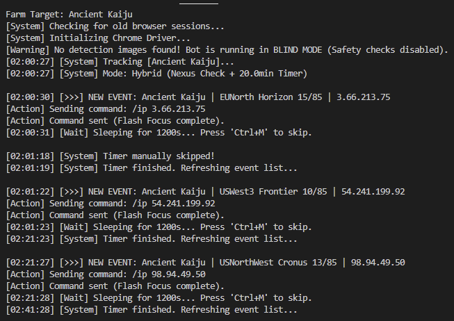

# RotMG Event Hopper (V1-V2 Hybrid) 🚀

A high-speed automation tool for **Realm of the Mad God Exalt**. This bot bypasses the standard web UI to scrape event data directly from RealmStock and injects `/ip` connection commands into the game client. 

Designed for 24/7 background operation with integrated safety checks to prevent joining runs while currently in a dungeon.

---

## Key Features

* **Direct API Scraper:** Bypasses standard UI refreshes to pull event IPs via UUID instantly.
* **Nexus Safety Check:** Uses pixel-detection to verify you are in the Nexus before attempting to jump (prevents deaths/disconnects).
* **Window Focus Injection:** Uses `pywin32` for low-latency command sending with minimal window focus time.
* **Zombie Cleanup:** Automatically nukes old Chrome/ChromeDriver processes on startup and exit.
* **Smart State Logic:** Automatically resets the search loop the moment you return to the Nexus from a run.
* **DPI Aware:** Handles Windows display scaling automatically for pixel-perfect accuracy.

---


Proof of it working in Visual studio code ^^
## Setup

### Prerequisites
* Python 3.10+
* Google Chrome
* A [RealmStock](https://realmstock.com) account (Requires valid Email + Static OTP/Order ID).

### Installation

1.  **Clone & Navigate:**
    ```bash
    git clone [https://github.com/c0urted/rotmg_goto_quest.git](https://github.com/c0urted/rotmg_goto_quest.git)
    cd rotmg_goto_quest
    ```

2.  **Install Dependencies:**
    ```bash
    pip install -r requirements.txt
    ```

3.  **Environment Setup:**
    Create a `.env` file in the root directory:
    ```ini
    RS_EMAIL=your_email@gmail.com
    RS_STATIC_OTP=your_static_otp
    WINDOW_TITLE=RotMGExalt
    ```

---

## 🔍 Nexus Detection Calibration

The bot requires calibration to distinguish between the Nexus and a dungeon.

1.  Stand in the **Nexus**.
2.  Run `python calibration.py`.
3.  Hover over static UI elements (Gold icon, Fame icon, or Shop button) and press **`Ctrl + B`**.
4.  Capture **3-5 points** and press **`Ctrl + S`** to save.


### How it Works
The bot checks your saved coordinates. If a majority of the pixels match (e.g., 3 out of 4), the bot stays in **Safe Mode**. If you enter a portal, the UI changes, the pixels no longer match, and the bot enters **Busy Mode** automatically.

---

## 💻 Running the Bot (VS Code & Admin)

To send the `/ip` command to the game, the bot must have permission to interact with the RotMG window.

1.  **Open VS Code as Administrator**: 
    - Close VS Code. 
    - Right-click the **VS Code shortcut**.
    - Select **"Run as Administrator"**.
2.  **Open the Terminal**: Press ``Ctrl + ` `` (backtick) inside VS Code.
3.  **Run the Script**:
    ```bash
    python main.py
    ```
*Note: If you do not run as Admin, the bot will scan successfully but the game will ignore the typed commands.*

---

## 🎮 Usage & Controls

1.  Launch RotMG Exalt and ensure you are in the Nexus.
2.  Update your `TARGETS` in `config.py` (e.g., `TARGETS = ["Cube God", "Lost Sentry"]`).
3.  **Controls**:
    - **`Ctrl + M`**: Force skip the current sleep timer.
    - **`Ctrl + C`**: Kill the bot and all associated browser sessions.

---

## Project Structure

* `main.py`: Primary loop and polished terminal interface.
* `core/scraper.py`: Selenium-based event scraper (V1 Logic).
* `core/state_detector.py`: Pixel-matching safety engine.
* `core/win_api_manager.py`: Handles background command injection.
* `pixel_config.json`: Stores your calibrated UI data.

---

## ⚠️ Disclaimer
This tool is for educational purposes. Automated event hopping is against ToS and we don't break the ToS! Use at your own risk.